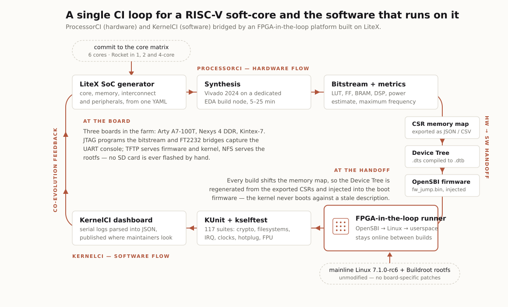

# Hybrid CI

A verificação de hardware avalia o processador isoladamente, enquanto projetos de CI de software, como o [KernelCI](https://kernelci.org), partem do princípio de que o hardware abaixo já é estável. Entre os dois existe uma zona intermediária: defeitos que só aparecem quando um sistema operacional completo roda sobre o núcleo, como falhas sutis de MMU, problemas no controlador de interrupções ou erros de coerência de cache. Um núcleo pode passar em todos os testes de conformidade e ainda assim não conseguir inicializar o Linux.

O Hybrid CI é nossa resposta a essa lacuna. Ele estende o Processor CI para formar um único laço de integração contínua, no qual um soft-core em evolução e uma pilha de software em evolução são exercitados um contra o outro em hardware real a cada commit. Chamamos essa abordagem de *CI híbrido de HW/SW*.

## Dois princípios

O laço se apoia em duas ideias que o diferenciam do fluxo usual de prototipação em FPGA.

A primeira é a **coevolução bidirecional**. Normalmente o software é tratado como uma suíte de regressão fixa, executada contra um hardware em evolução, de modo que apenas o hardware está em desenvolvimento. Aqui os dois lados têm o mesmo peso: os resultados dos testes orientam o fluxo de hardware, e mudanças no hardware disparam uma nova validação do software que roda sobre ele.

A segunda é o **hardware real como runner persistente de CI**. Em vez de colocar um projeto na placa, verificá-lo e removê-lo, o soft-core hospedado na FPGA permanece disponível entre as compilações e se comporta como qualquer outro runner de um sistema de CI de software, sempre pronto para receber implantações e devolver resultados.

## Do commit ao boot do Linux

Um commit em um núcleo dá início ao fluxo de hardware. O gerador de SoCs [LiteX](https://github.com/enjoy-digital/litex) constrói o sistema completo a partir de uma descrição em YAML, abrangendo núcleo, memória, interconexão e periféricos. Em seguida, o Vivado sintetiza o projeto em um nó de compilação dedicado, o que leva de 5 a 25 minutos e também produz as métricas físicas do projeto: uso de LUTs e flip-flops, estimativa de potência e frequência máxima.

A transferência entre os dois fluxos é a etapa mais delicada. Cada compilação altera o mapa de memória, e o software precisa acompanhar essa mudança. O pipeline automatiza esse processo: o LiteX exporta o mapa dos registradores de controle e status em JSON e CSV, um script reconstrói a topologia do hardware em um Device Tree, e o `.dtb` compilado é injetado na construção do OpenSBI para gerar um `fw_jump.bin` personalizado. Assim, o kernel nunca inicializa com uma descrição desatualizada, o que elimina os tradicionais *kernel panics* causados por descrições estáticas obsoletas.

Com o bitstream gravado via JTAG, a placa se torna um runner ativo. A BIOS do LiteX carrega o OpenSBI, o kernel Linux e o sistema de arquivos raiz por TFTP e NFS, sem que nenhum cartão SD precise ser gravado manualmente. Quando o kernel chega ao espaço de usuário, as ferramentas do KernelCI assumem o controle, monitoram o console serial para validar o teste de fumaça do boot e iniciam as suítes de regressão.

## O que executamos sobre o núcleo

O lado de software usa um kernel Linux mainline não modificado, sem correções específicas de placa, e um espaço de usuário mínimo gerado com o Buildroot. A validação executa 117 suítes de teste do KUnit, que cobrem estruturas de dados internas, algoritmos criptográficos, sistemas de arquivos e APIs de baixo nível do kernel, além de módulos do `kselftest` voltados a hotplug de CPU, estado da FPU e consumo de memória. Os logs seriais são convertidos em JSON e publicados nos mesmos painéis do KernelCI que os mantenedores do kernel já utilizam.

## Resultados atuais

Avaliamos seis núcleos RISC-V em três placas do laboratório: Digilent Arty A7-100T, Digilent Nexys 4 DDR e OpenSource SDR Lab Kintex-7. VexIIRiscv, CVA6, NaxRiscv e Rocket inicializaram o Linux mainline e passaram na suíte completa, sendo que o Rocket também foi avaliado em configurações de dois e quatro núcleos. BlackParrot e OpenC906 não chegaram à fase de validação no nível do sistema operacional: o primeiro por um erro de síntese e integração no LiteX e o segundo por uma exceção durante a transferência de controle do OpenSBI.

A demonstração mais clara da metodologia veio do Rocket com quatro núcleos. Ele passou em todas as suítes nas configurações de um e dois núcleos, mas falhou de forma consistente no teste `printk-ringbuffer` do KUnit, que estressa o acesso concorrente à memória entre threads. Verificamos que o bitstream atendia a todas as restrições de temporização e que os wrappers de interconexão eram idênticos aos da configuração estável de dois núcleos, o que aponta para um caso extremo no protocolo de coerência de cache ou no modelo de consistência de memória. É um defeito que nem a simulação RTL de um único núcleo nem os testes de conformidade tradicionais conseguem observar, e que só aparece sob uma carga multicore no nível do sistema operacional.

## Próximos passos

O Processor CI já dá suporte à síntese e à simulação RTL de mais de 100 núcleos RISC-V, e o próximo objetivo é levar essa escala para a validação no nível do sistema operacional. Também pretendemos combinar essa matriz ampliada com plataformas FPGA maiores, como a Xilinx VC709, para alcançar topologias multicore mais complexas, e integrar ao laço suítes formais de conformidade arquitetural do RISC-V.

## Artigo

A metodologia, a infraestrutura e a avaliação completa estão descritas em detalhe em:

- [Automated OS-Level Verification for RISC-V Softcores: Bridging FPGA and Linux KernelCI](assets/RSP2026_CI.pdf) — Julio N. Avelar, Marcio Godoi, Ana L. P. Costa, Rodolfo Azevedo e Sandro Rigo. A ser publicado no [37th International Workshop on Rapid System Prototyping (RSP 2026)](https://conferences.imt-atlantique.fr/rsp-symposium/), parte da Embedded Systems Week, Barcelona, Espanha, outubro de 2026.
